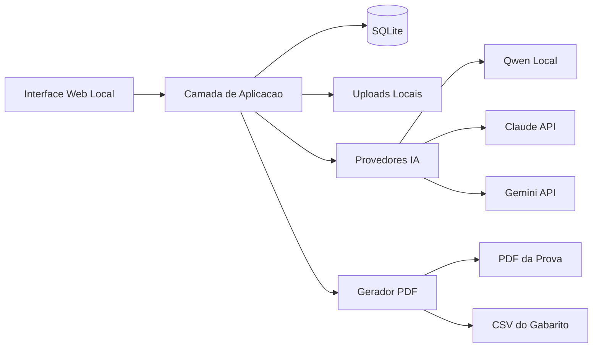

# Architecture

V1 sera um app web local. Programacao pesada fica para etapa posterior; esta nota define a estrutura geral.

## Stack Decidida
- **Interface**: Next.js + TypeScript.
- **Persistencia**: SQLite local.
- **Arquivos**: imagens em pasta local do projeto.
- **PDF**: render HTML de impressao + Chromium headless.
- **IA**: provedor escolhido pelo usuario a cada geracao.
- **Acesso**: sem login na V1.

## Componentes

## Camadas
- **UI**: telas de disciplinas, questoes, auditoria, geracao IA, montagem e exportacao.
- **Aplicacao**: regras de validacao, randomizacao, gabarito e orquestracao de IA/PDF.
- **Dados**: SQLite para entidades e pasta local para imagens.
- **Integracoes**: Qwen local, Claude API, Gemini API e gerador PDF.

## Principios
- Simplicidade local antes de multiusuario.
- Dados portaveis e faceis de backup.
- Randomizacao deterministica por set quando seed estiver disponivel.
- Exportacao separada da correcao: sistema gera prova e gabarito, EvalBee corrige fora.

## Decisoes Relacionadas
- [[DECISIONS]]
- [[EXPORTS_EVALBEE]]
