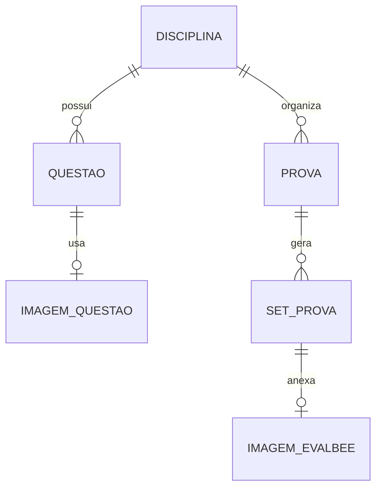

# Data Model

Modelo conceitual para V1. Campos exatos serao fechados quando a implementacao comecar.

## Entidades

### Disciplina
- Nome obrigatorio.
- Descricao opcional.
- Status ativo/inativo para organizacao futura.

### Questao
- Disciplina vinculada.
- Enunciado.
- Alternativas A, B, C, D, E.
- Alternativa correta.
- Imagem opcional.
- Status de revisao: rascunho, auditada, arquivada.

### Prova
- Disciplina.
- Titulo.
- Lista de questoes selecionadas.
- Quantidade de sets.
- Data/criacao opcional.

### Set de Prova
- Codigo do set, por exemplo A, B, C.
- Ordem final das questoes.
- Ordem final das alternativas por questao.
- Gabarito calculado apos randomizacao.
- Imagem EvalBee especifica do set.

### Arquivo Local
- Caminho relativo no projeto.
- Nome original.
- Tipo MIME.
- Uso: imagem de questao ou imagem EvalBee.

## Regras de Dados
- Toda questao objetiva tem exatamente cinco alternativas.
- A correta deve apontar para uma alternativa existente antes da randomizacao.
- O gabarito do set deve apontar para a letra final depois da randomizacao.
- Imagens nao ficam em URLs externas na V1.

> [!warning]
> Nao guardar chaves de API no banco. Usar configuracao local do ambiente quando programacao comecar.
