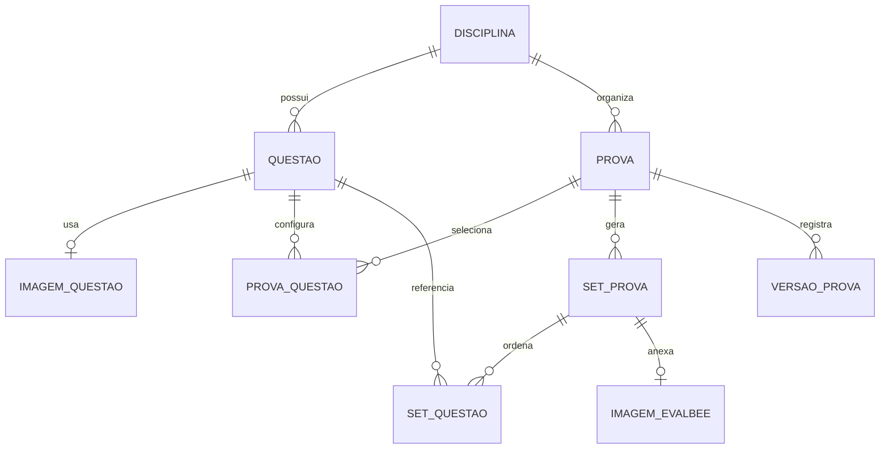

# Data Model

Modelo conceitual do estado implementado. O schema executável e as migrações incrementais vivem em `src/lib/db/schema.ts`.

```mermaid
erDiagram
    DISCIPLINA ||--o{ QUESTAO : possui
    DISCIPLINA ||--o{ PROVA : organiza
    QUESTAO ||--o| IMAGEM_QUESTAO : usa
    PROVA ||--o{ PROVA_QUESTAO : seleciona
    QUESTAO ||--o{ PROVA_QUESTAO : configura
    PROVA ||--o{ SET_PROVA : gera
    SET_PROVA ||--o{ SET_QUESTAO : ordena
    QUESTAO ||--o{ SET_QUESTAO : referencia
    PROVA ||--o{ VERSAO_PROVA : registra
    SET_PROVA ||--o| IMAGEM_EVALBEE : anexa
```

## Entidades

### Disciplina
- Nome e código único obrigatórios.
- Status ativo/inativo.

### Questao
- Disciplina vinculada.
- Enunciado.
- Tipo: `objetiva`, `verdadeiro_falso`, `numerica` ou `dissertativa`.
- Alternativas A–E e índice correto quando objetiva; resposta própria nos demais tipos.
- Imagem, área temática, dificuldade, justificativa e linhas de resposta quando aplicáveis.
- Estado de auditoria/recusa e origem manual ou IA.

### Prova
- `exam_questions.image_scale_percent` guarda apenas overrides de imagem 25..99; ausencia/100 usa escala segura padrao. O preview visual mantem o rascunho em estado client-side ate o submit.
- Disciplina.
- Titulo.
- Instituição, instruções, estado ativo e largura do gabarito.
- Layout `column|full` por tipo e permissão opcional de quebra de objetivas longas.
- Relação com as questões selecionadas e overrides individuais de largura.

### Set de Prova
- Codigo do set, por exemplo A, B, C.
- Ordem final das questoes.
- Ordem final das alternativas por questao.
- Gabarito calculado apos randomizacao.
- Imagem EvalBee especifica do set.

### Versão de Prova
- Snapshot JSON imutável com número sequencial e nota da alteração.
- Preserva conteúdo, layouts resolvidos, ordem de cada set, alternativas e respostas.
- Exportações históricas usam somente o snapshot solicitado.

### Arquivo Local
- Caminho relativo no projeto.
- Nome original.
- Tipo MIME.
- Uso: imagem de questao ou imagem EvalBee.

## Regras de Dados
- Toda questao objetiva tem exatamente cinco alternativas.
- A correta deve apontar para uma alternativa existente antes da randomizacao.
- O gabarito do set deve apontar para a letra final depois da randomizacao.
- O modo compacto altera a ordem persistida do set para `tipo → column → full`; não existe reordenação apenas visual na impressão.
- PDFs, CSV e rastreabilidade devem consumir a mesma posição persistida.
- Imagens de questão e EvalBee são arquivos locais servidos por rotas controladas.

> [!warning]
> Não guardar chaves de API no banco. Use configuração local do ambiente.
