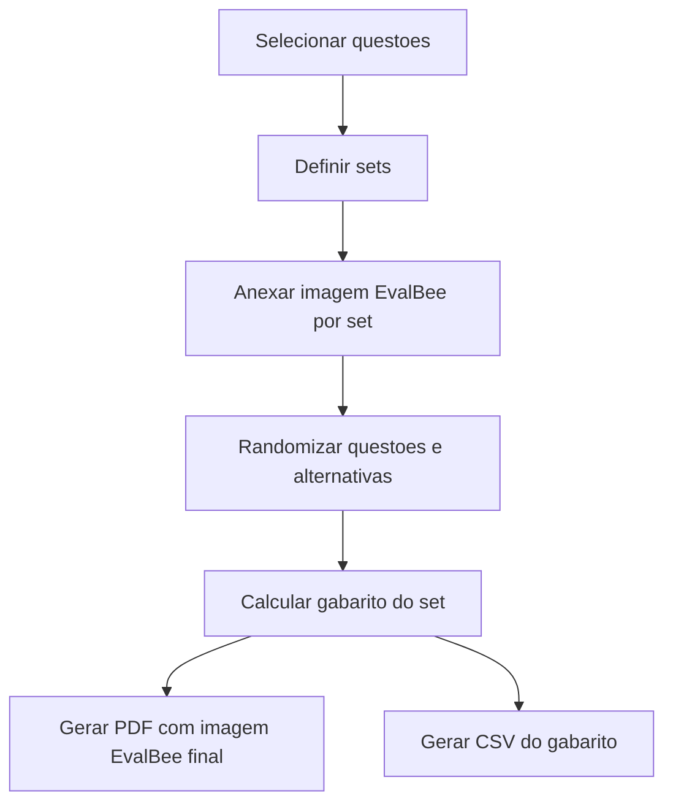

# Exports and EvalBee

O sistema gera prova para impressao e gabarito separado. A correcao acontece fora, no EvalBee.

## PDF da Prova
- PDF completo por prova: todos os sets em sequencia.
- PDF individual por set: renderiza apenas o set pedido, mas usa a mesma contagem fixa calculada para o lote.
- Layout em duas colunas.
- Questoes numeradas conforme ordem final do set.
- Alternativas exibidas conforme ordem randomizada.
- Imagens de questao dimensionadas para caber na coluna.
- Gabarito/imagem EvalBee fica sempre na ultima pagina do bloco do set.
- Se houver altura livre suficiente e isso nao quebrar o alvo uniforme do lote, o gabarito pode compartilhar essa ultima pagina com as ultimas questoes.

## Regra de paginas pares por lote
- O gerador calcula as paginas de questoes de todos os sets antes de renderizar.
- Primeiro tenta o menor total viavel por set: ultima pagina com gabarito inline quando couber; senao pagina final separada para o gabarito.
- `targetTotalPages` e o maior desses totais, arredondado para par.
- Se `targetTotalPages` for impar, soma 1 para ficar par.
- Sets menores recebem paginas totalmente vazias antes da pagina final do gabarito quando precisam de padding.
- Resultado: todos os sets do lote possuem a mesma quantidade par de frentes.

## Imagem EvalBee por Set
- Usuario anexa uma imagem diferente para cada set.
- Exemplo: set A recebe imagem EvalBee A, set B recebe imagem EvalBee B.
- Imagem pode ter a bolha do set ja marcada previamente pelo usuario.
- Sistema nao pinta bolhas automaticamente na V1.

## CSV de Gabarito
- Um CSV por set.
- Colunas: `Questão`, `Resposta`, `Enunciado`.
- Questao objetiva usa letra final ja randomizada (`A`-`E`).
- Verdadeiro/falso usa `V` ou `F`.
- Dissertativa usa `Dissertativa`.
- Filename: `gabarito-{safe-title}-set-{label}.csv` (slug a partir do título da prova; portável em Linux).
- Encoding: UTF-8 sem BOM; `Content-Disposition: attachment`.

## Exportacao de banco de questoes
- JSON e CSV de questoes ficam em `/api/export/questions`.
- JSON inclui `explanation` para todos os tipos.
- CSV inclui `explanation` como coluna final, depois de `answer_lines`.

## Fluxo de Exportacao

## Cuidados
- Gabarito deve ser calculado depois da randomizacao, nunca antes.
- PDF e CSV precisam identificar claramente o set.
- Se imagem EvalBee estiver ausente, sistema deve bloquear exportacao final ou avisar claramente antes de gerar rascunho.
