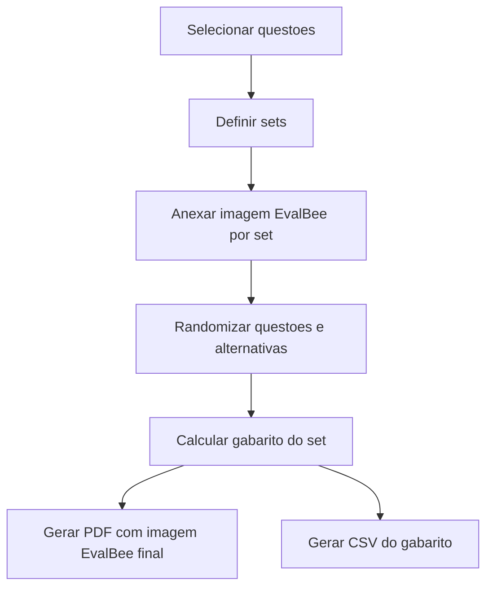

# Exports and EvalBee

O sistema gera prova para impressao e gabarito separado. A correcao acontece fora, no EvalBee.

## PDF da Prova
- Um PDF por set.
- Layout em duas colunas.
- Questoes numeradas conforme ordem final do set.
- Alternativas exibidas conforme ordem randomizada.
- Imagens de questao dimensionadas para caber na coluna.
- Ultima pagina reservada para imagem EvalBee do set.

## Imagem EvalBee por Set
- Usuario anexa uma imagem diferente para cada set.
- Exemplo: set A recebe imagem EvalBee A, set B recebe imagem EvalBee B.
- Imagem pode ter a bolha do set ja marcada previamente pelo usuario.
- Sistema nao pinta bolhas automaticamente na V1.

## CSV de Gabarito
- Um CSV por set.
- Deve conter:
  - codigo do set.
  - numero da questao na prova.
  - identificador interno da questao.
  - letra correta apos randomizacao.

## Fluxo de Exportacao

## Cuidados
- Gabarito deve ser calculado depois da randomizacao, nunca antes.
- PDF e CSV precisam identificar claramente o set.
- Se imagem EvalBee estiver ausente, sistema deve bloquear exportacao final ou avisar claramente antes de gerar rascunho.
