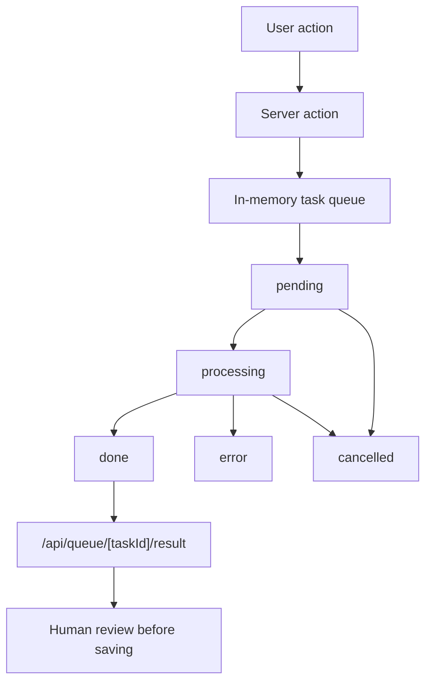

# Prompt T1-T11 Implementation Status

Source prompt: [[prompt|prompt.txt]].

> [!success]
> The 2026-04-24 prompt bundle is implemented in code, documented in Obsidian notes, and ready for validation before commit/push.

## Coverage Matrix

| Task | Status | Main evidence |
|---|---|---|
| T1 Dissertativa explanation | Done | `src/app/questions/_components/question-form.tsx`, `src/lib/db/schema.ts`, `src/lib/actions/questions.ts` |
| T2 Explanation in audit | Done | `src/app/audit/page.tsx` shows `ExplanationDisplay` for every type, with empty state |
| T3 Audit reload/modal issue | Done | audit actions moved to client components, all action buttons use `type="button"` where needed |
| T4 Linux-safe downloads | Done | JSON/CSV/PDF routes use safe filenames and UTF-8 response headers |
| T5 JSON/CSV syntax copy fields | Done | `/questions/importar` shows read-only JSON and CSV syntax fields plus copy buttons |
| T6 Remove generic question count | Done | `normalizeExamSelectionRequest` reads only per-type counts |
| T7 Uniform even PDF fronts | Done | `computeUniformTargetTotalPages` and two-pass set rendering pad blank pages before answer key |
| T8 Audit task queue | Done | `src/lib/task-queue.ts`, queue API routes, `QueuePanel`, audit handler in `instrumentation.ts` |
| T9 AI generation task queue | Done | batch and single-question AI generation enqueue tasks and recover results through `?task=` links |
| T10 Preserve form data after errors | Done | React `useActionState`, controlled AI forms, and exam count URL preservation |
| T11 Documentation | Done | this note plus [[AI_GENERATION]], [[EXPORTS_EVALBEE]], [[SCREEN_MAP]], [[DECISIONS]], [[SESSION_LOG]], [[TODO]] |

## Queue Model



## PDF Rule

- Build question pages for every set first.
- Compute fixed total pages as `max(questionPages) + 1 answer-key page`.
- Round fixed total to the next even number.
- Insert fully blank pages before the answer key.
- Keep the answer key as the final page of every individual set block.
- PDF by set renders only the requested set, but uses the full exam batch target.

## JSON and CSV Import Syntax

- JSON schema lives in `QuestionExportFileSchema`.
- CSV parser supports quoted commas/newlines and includes `explanation` as column 12.
- UI now exposes visible, copyable syntax examples for all three question types.

## Obsidian/GitHub Notes

- Project knowledge lives in `docs/*.md` as an Obsidian-compatible vault.
- Use [[INDEX]] as the entry point.
- See [[OBSIDIAN_GITHUB]] for what should be committed and what stays local.

## Validation

Last validation for this bundle, 2026-04-24:

```powershell
npm run typecheck      # pass
npm run lint           # pass
npm test -- --run      # pass, 36 tests / 6 files
npm run build          # pass, 28 app routes
```

Update this section after every implementation bundle with the exact pass/fail result in [[SESSION_LOG]].
