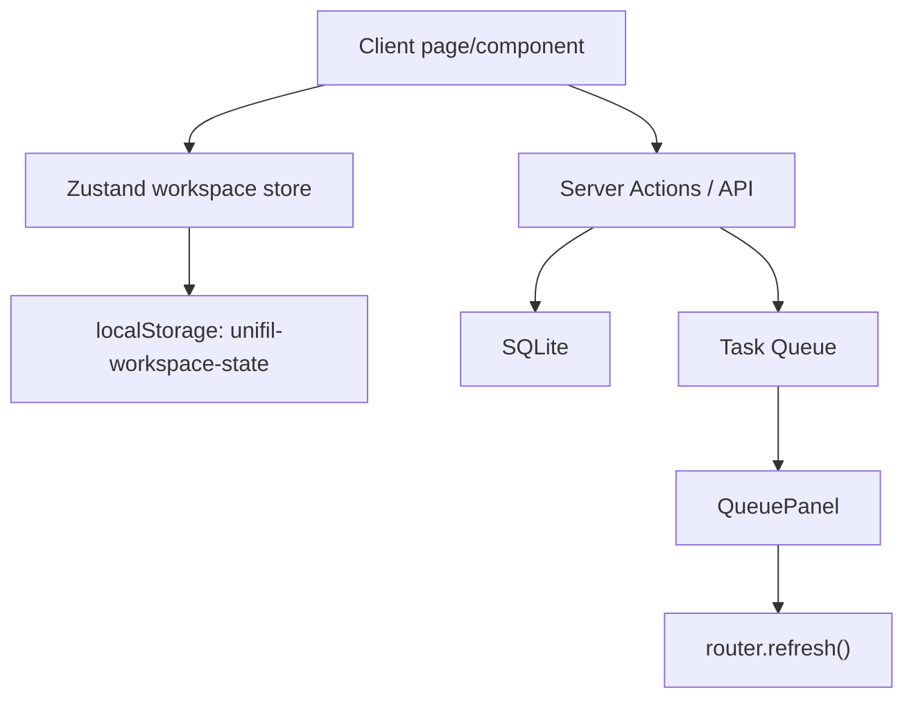

# Workspace State Persistence Plan

> [!important]
> Goal: add a Pinia-equivalent client state layer for UniFil Exams using Zustand. This is UI/workspace state only; source-of-truth data remains SQLite and server actions.

## Problem

Current pages are mostly route-based. When the user moves between `/ai`, `/audit`, `/exams`, and `/questions`, React page state can be lost because the active route unmounts.

The desired experience is closer to a local desktop app:

- Start AI generation.
- Navigate to audit questions.
- Return to AI and still see the same draft/task/result.
- Keep exam assembly form values while checking another page.
- Keep question form drafts if the user navigates away by accident.

## Decision

Use [[OBSIDIAN_GITHUB|versioned project docs]] plus a client-side Zustand store with `persist`.

Equivalent mapping:

| Vue concept | React/Next equivalent |
|---|---|
| Pinia store | Zustand store |
| Pinia persisted state plugin | Zustand `persist` middleware |
| Route component local state | Per-screen slice in `workspace-store` |
| Server database state | SQLite, unchanged |

## Architecture

## Scope

### Phase 1 — Foundation
- Install `zustand`.
- Create `src/lib/state/workspace-store.ts`.
- Persist with versioned store name.
- Add reset helpers per screen.

### Phase 2 — AI Screens
- Persist `/ai` fields:
  - `disciplineId`
  - `provider`
  - `questionType`
  - `ollamaModel`
  - `topic`
  - `queuedTaskId`
- Persist `/ai/import` fields:
  - `disciplineId`
  - `provider`
  - `questionType`
  - `ollamaModel`
  - `rawText`
  - `queuedTaskId`

### Phase 3 — Exam Assembly
- Persist `/exams` draft form:
  - `title`
  - `institution`
  - `quantitySets`
  - `numObjetivas`
  - `numVF`
  - `numDissertativas`

### Phase 4 — Manual Question Drafts
- Persist `/questions/new` draft:
  - selected discipline
  - type
  - statement
  - options
  - correct index
  - thematic area
  - explanation
  - answer lines
- Keep file inputs out of persisted state.

## Constraints

- Do not persist secrets or API keys.
- Do not persist uploaded images/files.
- Do not replace server-side data fetching with Zustand.
- Do not rewrite the app into a fake-navigation workspace in this pass.
- Keep implementation incremental and reversible.

## Acceptance Criteria

- [x] Navigating away from `/ai` and back preserves the typed topic and selected provider/type.
- [x] Navigating away from `/ai/import` and back preserves pasted text and selected provider/type.
- [x] Active queued AI task IDs survive route changes and continue polling when the user returns.
- [x] Exam assembly quantities survive route changes.
- [ ] Question form draft survives route changes without persisting file input.
- [x] User can clear a saved draft manually via reset helper where appropriate.
- [ ] Validation passes: `typecheck`, `lint`, tests, build.

## Implementation Status

Implemented in this pass:

- `src/lib/state/workspace-store.ts` centralizes the workspace state with Zustand `persist`.
- `/ai` stores single-generation draft fields and the active queued task id.
- `/ai/import` stores batch-generation draft fields and the active queued task id.
- `/exams` stores exam assembly fields through a client component while keeping database reads/actions server-side.

Deferred:

- `/questions/new` manual draft persistence. The store shape already has `questionDrafts`, but wiring the existing form should be done carefully because file/image inputs cannot be persisted.

## Future Workspace Mode

After persistence is stable, a future route such as `/workspace` can keep multiple panels mounted at once:

- AI generation panel.
- Audit panel.
- Exam assembly panel.
- Export panel.

That would create the "fake navigation" feel, but it should build on this persisted store rather than replacing it.
